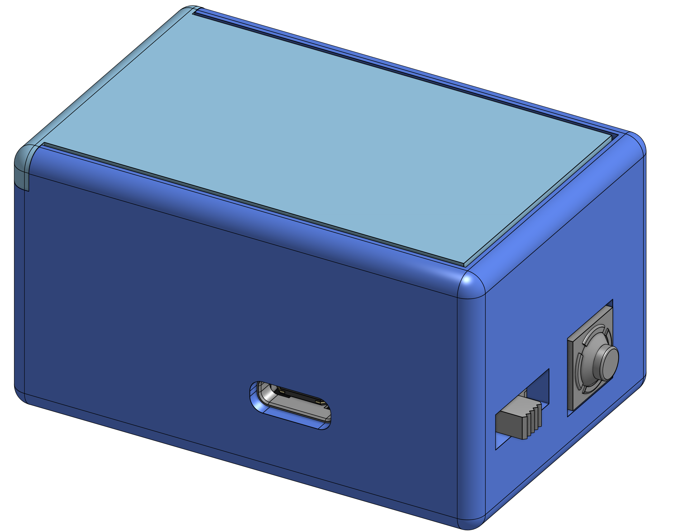
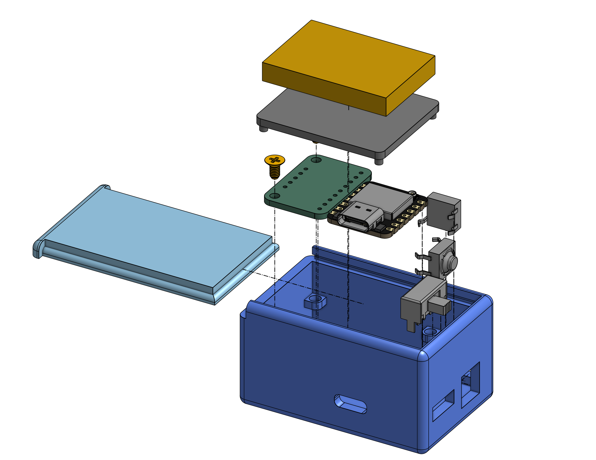
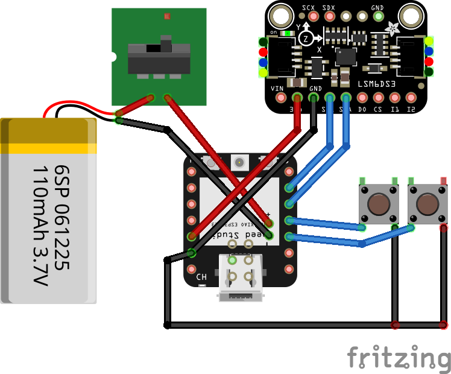

# The Wand
A fun little mouse that doesn't need an optical sensor! The wand has two physical buttons to act as left and right mouse buttons. A gyroscope acts as a scroll controller, scrolling up and down based on the tilt of the wand. An accelerometer detects the movement of the wand, allowing it to be used as a mouse pointer. An ESP32S3 powers the wand, and it connects to a computer via Bluetooth HID.

### Why?
Two main reasons:
1. I teach codding and math classes every week, and I'd love to write on a digital whiteboard. Unfortunately, I find drawing with my current mouse hard. I think the Wand is smaller, so it should be nicer to hold (it's like a very very chunky pencil). I think it would also be cool to be able to draw in midair so I can write on the whiteboard while walking around the classroom.
2. I work on a very glossy table sometimes and my optical mouse doesn't work well on it. The Wandd should solve this problem, since it's based on motion only.

## 3D Model
 

## Wiring

*Note: Despite what the wiring diagram says, the Wand plans to use a 420mAh battery*

## BOM
See the bom [here](BOM.csv) too!
| Part | Quantity | Price (USD) | Source |
| ---- | -------- | ----------- | ------ |
| Xiao ESP32S3 | 1 | 7.49 | [Seeed](https://octopart.com/opatz8j6/a1?t=iGINWb-pOFoDR6J4OBaV-c_PxjBp4hYKZUA_Jv6fUrz0qgPM3kMQCfNabeqoILV3gMVdSeLOqTMmWgJE6dpeTdfQe_umBKLnbMFIkGVaOZfruk_JCTi1YlxBCt-4ZfZUM15JSNk5DvOTbllupusxp0vuGl3jC7J0p2fP5iQJRrAz7A8F43ccIF2FvbYfko1sD6Kn6h7ZQJeQ3bI729eyCb4ICYwOiAyPkE_t22fTRMsU-DrP7d2z8_6rH3yx4MaKhSPnY65W2ZKrablQA6a80WEvTSWY) |
| Adafruit LSM6DSOX 6 DoF Accelerometer and Gyroscope | 1 | 11.95 | [Adafruit](https://www.adafruit.com/product/4438) |
| Soft Tactile Buttons (Pack of 10) | 1 | 1.95 | [Adafruit](https://www.adafruit.com/product/3101) |
| 420mAh LiPo Battery | 1 | 6.95 | [Adafruit](https://www.adafruit.com/product/4236) |
| JST Header | 1 | 0.75 | [Adafruit](https://www.adafruit.com/product/3814) |
| 24 AWG Silicone Wire (1 ft) | 3 | 2.85 | [Mouser](https://octopart.com/opatz8j6/a1?t=Ns-dX9HA_8R3_XDTJzSakAcXoz2ePhvdZYvFjFsMdNEp491dyJbjK9EUbvHaT9kNnqt_gi9g2C3uCv7m1gcxRtHDDWcS56ZsZnmRGYx3R6DgKW2u103AIcLKOqB08kejn8lPRA_xXN149lowVVnJe_9OVUq_B83inQsym4YilZs-qhXNfQVZf9G-jQ1xMeDiQcP2bjP7t4SzPeWfyGZ6H0Ik0jKviRIpY1EmKdgZYtm8wphO3dWwY926yoB9i3srxTkNR9F2nze4C6WBqQTjSJUjuXo) |
| M2.5x.45 Thread Screws | 2 | 0.22 | [Mouser](https://octopart.com/opatz8j6/a1?t=pZCgxuvQWyc8RYCiDzuzQo3qqC22T-oWTCVSkPP_l8Yhkd6-vvuWTUOQsGh3Wcrm-gC9-zyTvokq2LOvWUshOSPMx63BuPzcuceuTpNWDqeM0brYkbMFbJ6YLxa22tIoXf7Y5aAFiK4AA9hALZto9aNJkpo2p203TwPDg_rauIg2bD1NVf8qbz__Lj0WAiF8MrivCUwN-ZQq3CRMIRmUjJgjzXaL0xBkocaMHCPuhDBIh_sEzrsveRDTFPDrf2RL8C7crUMPJ6NSfDjCwremq7kGAkQM) |
| Slide switch | 1 | 0.35 | [Mouser](https://octopart.com/opatz8j6/a1?t=rX5jNHe9JtIGQfXOs1VLqbB_Mi7Z2WxOh4_kc3ONFL0PU6gpEjVTJtcGq9r3zYKdeOhGFZg7xyb4NlZl4R4oZzmWmU1cqGMoVDa-vZzpjOQDf9jwKzMaVsG1Hn2pg8AL8gymTI_W2qLRfqZZj761PW2bdhDw5tkYj-qOKyr2RXoM3Nhqlavl7cKJMce9q73mplivq8uupjIpd2U5PAEQU_ub14rDRV3IGTV6ytjUdmSjgq2fiQOo3VWlUN0CRhsK-XVbEKo-42xM_NcHR0dMiaEfgKYmPQ) |
| Wire stripper/cutter | 1 | 6.99 | [Amazon](https://a.co/d/gpYgt5D) |
| LiPo Safe Battery Pouch | 1 | 12.99 | [Amazon](https://a.co/d/eOVSK29) |
